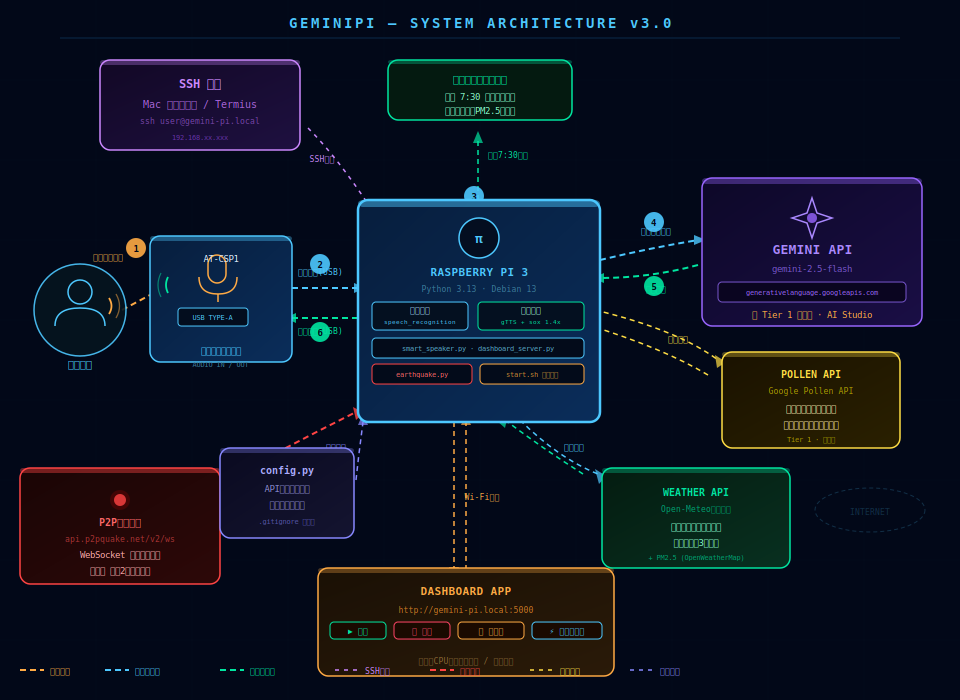
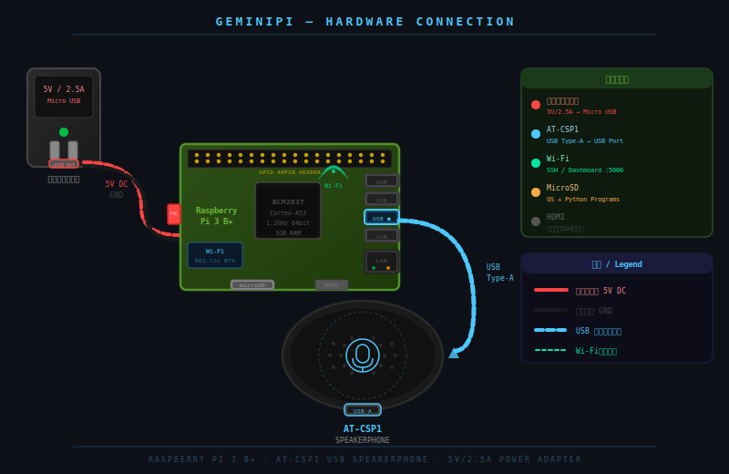
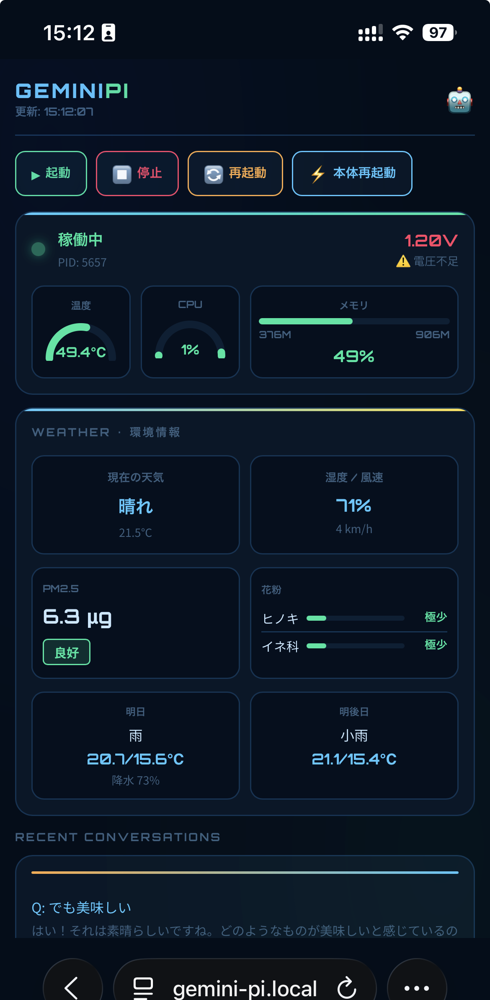

# Gem-Pi — Gemini搭載 AI スマートスピーカー


**Raspberry Pi 3 × Google Gemini AI × AT-CSP1 で作る、家族のための AI スピーカー**


---

## 概要 / Overview

日本で買えるスマートスピーカーって、正直まだ賢くない。
天気は教えてくれるけど、子供の「なんで？」には答えられない。

だから作った。

Gem-Pi は Raspberry Pi 3 と Google の最新 AI「Gemini 2.5 Flash」を組み合わせた、自作 AI スピーカーです。
「OK Google」と呼びかけるだけで、哲学的な質問にも、今日の花粉にも、地震速報にも答えてくれる。
市販品にはない、本物の AI 会話がここにある。

Smart speakers in Japan? Still kind of dumb, honestly.
They'll tell you the weather — but they can't handle a kid asking "why does the sky exist?"

So I built one that can.

GeminiPi pairs a Raspberry Pi 3 with Google's latest AI, Gemini 2.5 Flash.
Say "OK Google" and it handles anything — deep questions, pollen counts, earthquake alerts, morning weather.
Real AI conversation. No subscription. Built from scratch.

---

## システム構成図 / Architecture

[インタラクティブ構成図を見る / View Interactive Architecture](https://jokerzart.github.io/Gemini-Pi/architecture.html)



## ハードウェア接続図 / Hardware Diagram

[ハードウェア接続図を見る / View Hardware Connection Diagram](https://jokerzart.github.io/Gemini-Pi/fritzing_diagram.html)



---

## 機能 / Features

| 機能 | 説明 |
|------|------|
| ウェイクワード検知 | 「OK Google」で起動 |
| AI 会話 | Gemini 2.5 Flash による自然な応答 |
| 天気予報 | 現在・今日・明日・明後日の天気、昨日比較、降水確率 |
| PM2.5 | OpenWeatherMap API でリアルタイム取得 |
| 花粉情報 | Google Pollen API でスギ・ヒノキ・イネ科の飛散指数 |
| 服装アドバイス | 子供向けに気の利いたアドバイスを自動生成 |
| 朝の自動アナウンス | 毎朝 7:30 に天気・花粉・PM2.5・服装を自動読み上げ |
| 地震速報 | P2P地震情報 WebSocket で福岡県・震度2以上を即座に読み上げ |
| キャンセル機能 | 「キャンセル」でいつでも中断 |
| Spotify Connect | Raspotify 経由でスピーカーとして使用可能 |
| スマホダッシュボード | 起動・停止・再起動・天気・PM2.5・花粉・電圧・会話ログ |
| OLED ディスプレイ | カセットテープ風アニメーション・各種状態表示 |

---

## OLED ディスプレイ / OLED Display

0.96インチ SSD1306 OLED（128x64）を接続することで、状態に応じた表示が楽しめます。

| 状態 | 表示内容 |
|------|------|
| 待機中 | カセットテープ風アニメーション（リール回転・テープのたるみ）＋時計 |
| 30秒ごと | パックマンが幽霊を追いかけながら時計を食べて右に消える |
| 聞き取り中 | 音声波形アニメーション＋質問テキスト |
| AI処理中 | 「Gemini...」表示 |
| 回答読み上げ中 | 回答テキストをスクロール表示 |
| Spotify 再生中 | ミラーボール＋棒人間がダンスするディスコモード |
| 地震速報 | 全画面点滅警告 |

---

## スマホダッシュボード / Dashboard



スマホブラウザから以下が操作・確認できます：

- 稼働状態の確認
- CPU温度・使用率・メモリのリアルタイム表示
- 電源電圧の監視（電圧不足を検知して警告表示）
- 現在の天気・気温・湿度・風速
- PM2.5（3段階カラー表示）
- 花粉情報（スギ・ヒノキ・イネ科 バーグラフ）
- 明日・明後日の天気予報
- 起動 / 停止 / 再起動 / 本体再起動
- 直近の会話ログ

iPhoneの場合、Safari で開いて「ホーム画面に追加」するとアプリのように使えます。

---

## 必要なもの / Requirements

### ハードウェア / Hardware

- Raspberry Pi 3 Model B+
- Audio-Technica AT-CSP1（USB スピーカーフォン）
- MicroSD カード 16GB 以上
- 電源（5V / 2.5A）
- 0.96インチ OLED ディスプレイ（SSD1306 I2C）※任意

### ソフトウェア / Software

- Raspberry Pi OS (Debian 13)
- Python 3.13

### API キー / API Keys

| サービス | 用途 | 料金 |
|---------|------|------|
| [Google AI Studio](https://aistudio.google.com) | Gemini API | 無料枠あり / Tier 1 後払い |
| [OpenWeatherMap](https://openweathermap.org) | PM2.5 | 無料 |
| [Google Cloud](https://console.cloud.google.com) | Pollen API | 月数円程度 |
| [P2P地震情報](https://www.p2pquake.net) | 地震速報 | 完全無料 |
| [Open-Meteo](https://open-meteo.com) | 天気予報 | 完全無料 |

---

## ファイル構成 / File Structure

```
gemini-pi/
├── smart_speaker.py      # メインプログラム（音声認識・AI応答・天気取得）
├── dashboard_server.py   # スマホダッシュボード（Flask）
├── earthquake.py         # 地震速報モニター（WebSocket）
├── oled_display.py       # OLEDディスプレイ制御
├── start.sh              # 一発起動スクリプト
├── config_sample.py      # 設定ファイルのサンプル（APIキーはダミー）
├── .gitignore            # config.py を除外
└── README.md             # このファイル
```

> `config.py` は `.gitignore` で除外しています。`config_sample.py` をコピーして使ってください。

---

## セットアップ / Setup

### 1. リポジトリをクローン

```bash
git clone https://github.com/jokerzart/Gemini-Pi.git
cd Gemini-Pi
```

### 2. 必要なライブラリをインストール

```bash
pip install google-genai speechrecognition gtts flask flask-cors psutil websocket-client luma.oled --break-system-packages
sudo apt install sox libsox-fmt-mp3 python3-pyaudio fonts-noto-cjk -y
```

### 3. 設定ファイルを作成

```bash
cp config_sample.py config.py
nano config.py
```

以下を自分の環境に合わせて編集：

```python
GEMINI_API_KEY  = "your_gemini_api_key"
OWM_API_KEY     = "your_openweathermap_key"
POLLEN_API_KEY  = "your_google_pollen_key"

LATITUDE        = 33.73
LONGITUDE       = 130.47
LOCATION_NAME   = "福岡県古賀市"
PREFECTURE      = "福岡県"

AUDIO_DEVICE    = "plughw:2,0"  # arecord -l で確認
TEMPO           = "1.4"

MORNING_HOUR    = 7
MORNING_MINUTE  = 30

MIN_INTENSITY   = 2
```

### 4. OLED ディスプレイの接続（任意）

| OLED | Raspberry Pi |
|------|------|
| GND | Pin 6 (GND) |
| VCC | Pin 1 (3.3V) |
| SCL | Pin 5 (GPIO3) |
| SDA | Pin 3 (GPIO2) |

I2C を有効化：

```bash
sudo raspi-config
# Interface Options → I2C → Enable
```

接続確認：

```bash
i2cdetect -y 1
# 3c が表示されれば OK
```

### 5. Spotify Connect の設定（任意）

```bash
curl -sL https://dtcooper.github.io/raspotify/install.sh | sh
```

### 6. 起動

```bash
chmod +x start.sh
./start.sh
```

### 7. ダッシュボードにアクセス

```
http://gemini-pi.local:5000
```

---

## 使い方 / Usage

```
「OK Google、今日の天気は？」
→ 天気・気温・降水確率・PM2.5・花粉・服装アドバイスを読み上げ

「OK Google、なんで空は青いの？」
→ Gemini AI が子供にもわかりやすく答えてくれる

「キャンセル」
→ 読み上げをいつでも中断
```

毎朝 7:30 には自動で天気情報を読み上げます。

---

## 地震速報 / Earthquake Alert

P2P地震情報の WebSocket API を使用しています。

- 福岡県で震度 2 以上の地震が発生した場合に即座に読み上げ
- 緊急地震速報（警報）にも対応
- 自動再接続機能あり（切断時に5秒後に再接続）
- OLED ディスプレイで全画面点滅警告

---

## 設定変更 / Configuration

すべての設定は `config.py` で一元管理しています：

```python
TEMPO = "1.4"          # 読み上げ速度（1.0=普通）

MORNING_HOUR   = 7     # 朝の天気アナウンス時刻
MORNING_MINUTE = 30

MIN_INTENSITY  = 2     # 地震速報の最小震度
```

---

## システム構成 / Architecture

```
ユーザー
  ↓（声で呼びかけ）
AT-CSP1（マイク）
  ↓（USB音声入力）
Raspberry Pi 3
  ├── smart_speaker.py
  │     ├── 音声認識（speech_recognition）
  │     ├── Gemini API（質問・回答）
  │     ├── Weather API（天気・PM2.5）
  │     ├── Pollen API（花粉）
  │     └── gTTS（音声合成）→ AT-CSP1（スピーカー）
  ├── dashboard_server.py（Flask / port 5000）
  ├── earthquake.py（P2P地震情報 WebSocket）
  └── oled_display.py（SSD1306 I2C）
```

---

## 使用ライブラリ / Dependencies

```
google-genai        # Gemini AI API
speechrecognition   # 音声認識
gtts                # Google Text-to-Speech
flask               # ダッシュボード Web サーバー
flask-cors          # CORS 対応
psutil              # システム情報取得
websocket-client    # 地震速報 WebSocket
sox                 # 音声変換・速度調整
luma.oled           # OLED ディスプレイ制御
```

---

## セキュリティ / Security

- `config.py` は `.gitignore` で除外済み（APIキーは公開されません）
- ダッシュボードは同一ネットワーク内からのみアクセス可能
- Tailscale を使用することで外出先からも安全にアクセス可能

---

## ライセンス / License

MIT License

---

## 使用API・サービス / Credits

- [Google Gemini API](https://ai.google.dev)
- [Open-Meteo](https://open-meteo.com) — 天気予報
- [OpenWeatherMap](https://openweathermap.org) — PM2.5
- [Google Pollen API](https://developers.google.com/maps/documentation/pollen) — 花粉情報
- [P2P地震情報](https://www.p2pquake.net) — 地震速報
- [Raspotify](https://github.com/dtcooper/raspotify) — Spotify Connect

---

*子供たちのために*
